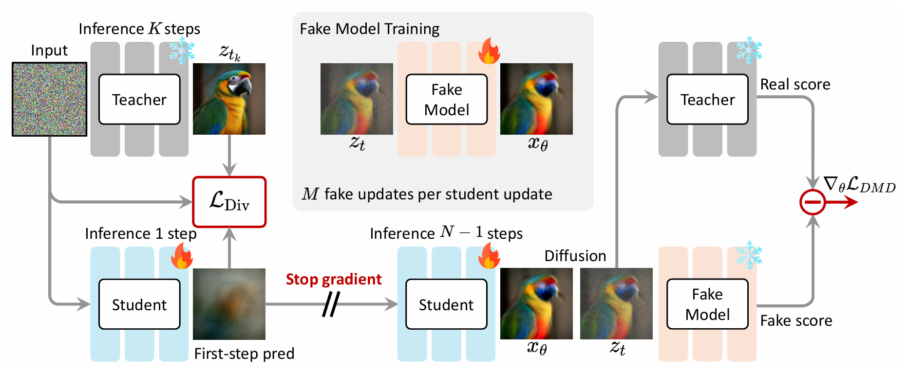

<div align="center">

# Diversity-Preserved Distribution Matching Distillation for Fast Visual Synthesis


<div style="font-family: charter;">
    <a href="https://tianhewu.github.io/tianhe-page/" target="_blank">Tianhe Wu<sup>* 1 3</sup></a>,
    <a href="https://scholar.google.com/citations?hl=zh-TW&user=FMNs2K0AAAAJ" target="_blank">Ruibin Li<sup>* 2</sup></a>,
    <a href="https://www4.comp.polyu.edu.hk/~cslzhang/" target="_blank">Lei Zhang<sup>2 3</sup></a>,
    <a href="https://kedema.org/" target="_blank">Kede Ma<sup>1</sup></a>
    <br>
    <sup>1</sup>City University of Hong Kong
    <sup>2</sup>The Hong Kong Polytechnic University
    <sup>3</sup>OPPO Research Institute
</div>


> *No perceptual backbone, no discriminator, no auxiliary networks, and no additional ground-truth images.*

[](https://arxiv.org/abs/2602.03139)
[](https://huggingface.co/TianheWu/dpdmd) 
[](https://github.com/Multimedia-Analytics-Laboratory/dpdmd)
</h5>


<div align="center">
    
    
</div>


</div align="center">


## ⚙️ Installation

To set up the environment, we recommend using Conda to manage dependencies. Follow these steps to get started for **training**:

```Bash
conda create -n dpdmd python=3.10.16
conda activate dpdmd

pip install -e .
```

During training, your model will be evaluated using **DINOv2**, **CLIP**, **ImageReward**, and **PickScore** metrics, all of which are available in the installed `dpdmd` environment above.

😟 **Attention1** `[new env name: test_div]`: **DINOv3** requires `transformers >= 4.57.0`, which is incompatible with the **ImageReward** metric. Therefore, it is recommended to use **DINOv2** during training. If you need to evaluate with **DINOv3** after training, please create a separate conda environment and upgrade the `transformers` version accordingly.

😟 **Attention2** `[new env name: vq]`: For visual quality evaluation, please follow [VisualQuality-R1](https://github.com/TianheWu/VisualQuality-R1). After setup, install `timm` via `pip install timm` to enable the **MANIQA** metric. Creating a new environment for this step is very simple and recommended.

😊 Overall, three separate environments may be required: one for training and human preference evaluation (**ImageReward**, **PickScore**, **DINOv2** and **CLIP**), one for visual quality evaluation (**VisualQuality-R1** and **MANIQA**), and one for diversity evaluation (**DINOv3** and **CLIP**). If **DINOv3** is not used, only two environments are needed: one for training (including human preference evaluation) and one for visual quality evaluation.


## ⚡ Qucik Inference

soon..


## 🚀 Training

<div align="center">
    
</div>

Starting the training process is very very easy. Please follow the three steps below.

### Data Preparation

We only use text prompts for training. Example prompts can be found in the `data/` folder (one text prompt per line). All prompts are stored in `.txt` format.

### Pretrainined Model Preparation

Before starting training, you should first download the required files:
- [[SD3.5 Medium]](https://huggingface.co/stabilityai/stable-diffusion-3.5-medium) stable-diffusion-3.5-medium 
- [[PickScore processor]](https://huggingface.co/laion/CLIP-ViT-H-14-laion2B-s32B-b79K) CLIP-ViT-H-14-laion2B-s32B-b79K
- [[PickScore]](https://huggingface.co/yuvalkirstain/PickScore_v1) PickScore_v1
- [[ImageReward]](https://huggingface.co/zai-org/ImageReward) ImageReward
- [[DINOv2]](https://huggingface.co/facebook/dinov2-base) dinov2-base
- [[CLIP]](https://huggingface.co/openai/clip-vit-large-patch14) clip-vit-large-patch14

Then you should modify the weight path in training script which is located at `scripts/run_train_sd35.sh`. 

```Bash
--teacher_id weights/stabilityai/stable-diffusion-3.5-medium \
--student_id weights/stabilityai/stable-diffusion-3.5-medium \
--fake_id weights/stabilityai/stable-diffusion-3.5-medium \
--pick_processor_path weights/CLIP-ViT-H-14-laion2B-s32B-b79K \
--pick_model_path weights/PickScore_v1 \
--ir_model_path weights/ImageReward/ImageReward.pt \
--ir_med_config weights/ImageReward/med_config.json \
--dino_path weights/dinov2-base \
--clip_path weights/clip-vit-large-patch14 \
```


### Start Training


😟 **Attention**: When starting a training experiment, you should keep  
`sd35_dpdmd/sd35m_t30_1024_lr1e5_4nfe_anchor5` (example) consistent across the following arguments to ensure that all generated files are stored under the same root folder.

```bash
--log_path outputs/sd35_dpdmd/sd35m_t30_1024_lr1e5_4nfe_anchor5/log \
--ckpt_dir outputs/sd35_dpdmd/sd35m_t30_1024_lr1e5_4nfe_anchor5/ckpts \
--eval_dir outputs/sd35_dpdmd/sd35m_t30_1024_lr1e5_4nfe_anchor5/eval_images \
--process_folder_name outputs/sd35_dpdmd/sd35m_t30_1024_lr1e5_4nfe_anchor5/process_vis \
--diversity_folder_name outputs/sd35_dpdmd/sd35m_t30_1024_lr1e5_4nfe_anchor5/div_vis \
```

- `log_path`: stores training log information.
- `ckpt_dir`: stores checkpoint weights.
- `eval_dir`: stores generated images used for human preference evaluation during training (overwritten at each evaluation step).
- `process_folder_name`: stores student model output images during training (overwritten at each iteration).
- `diversity_folder_name`: stores images used for diversity evaluation during training (overwritten at each evaluation step).


After completing all the preparations, run the following command to **start training**.
```Bash
bash scripts/run_train_sd35.sh
```


## 🛠️ Testing

We provide the testing files for diversity evaluation (`test_diversity.py`), human preference evaluation (`test_preference.py`), and visual quality evaluation (`test_quality.py`). Please ensure that the required environments for each evaluation are installed beforehand.  

Instructions for modifying paths or loading model weights are included within each file.

- Human Preference:
`accelerate launch --main_process_port 29512 test_preference.py`
- Visual Quality:
`python test_quality.py`
- Diversity:
`CUDA_VISIBLE_DEVICES=0 accelerate launch --main_process_port 29519 --num_processes 1 test_diversity.py`


## 💪 Acknowledgement
I would like to sincerely thank [Gongye Liu](https://gongyeliu.github.io/), Ke Lei (Tsinghua University), and [Zhuoyan Luo](https://scholar.google.com/citations?user=mKQhEsIAAAAJ&hl=en&oi=ao) for the generous support of my project and for the invaluable guidance in the field of generative modeling.


## 📧 Contact
If you have any question, please email `tianhewu-c@my.cityu.edu.hk`.


## 🌟 BibTeX
```
@article{wu2026diversity,
  title={Diversity-Preserved Distribution Matching Distillation for Fast Visual Synthesis},
  author={Wu, Tianhe and Li, Ruibin and Zhang, Lei and Ma, Kede},
  journal={arXiv preprint arXiv:2602.03139},
  year={2026}
}
```