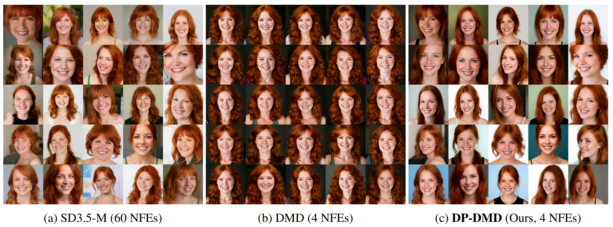
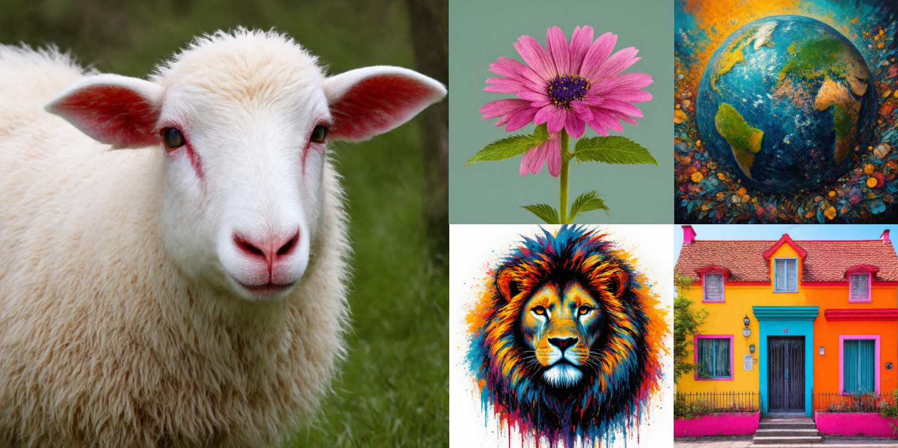

# Diversity-Preserved Distribution Matching Distillation for Fast Visual Synthesis

    This is the official code of DP-DMD.

    <a href="https://tianhewu.github.io/tianhe-page/" target="_blank">Tianhe Wu*</a>,
    <a href="https://scholar.google.com/citations?hl=zh-TW&user=FMNs2K0AAAAJ" target="_blank">Ruibin Li*</a>,
    <a href="https://www4.comp.polyu.edu.hk/~cslzhang/" target="_blank">Lei Zhang</a>,
    <a href="https://kedema.org/" target="_blank">Kede Ma</a>
     

    
    

Code will be released soon.